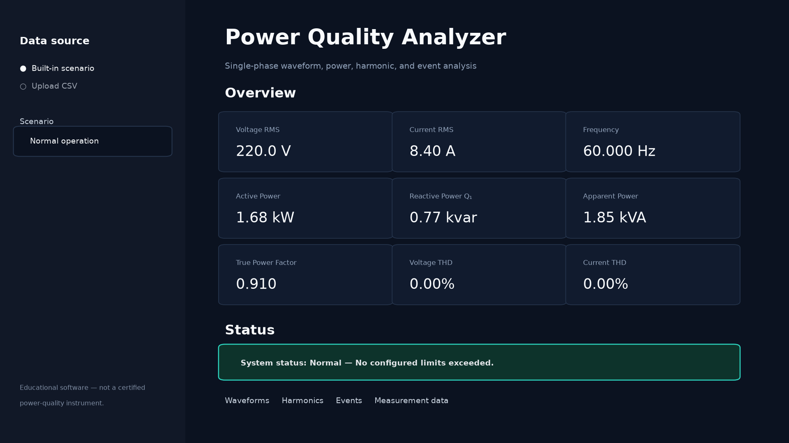
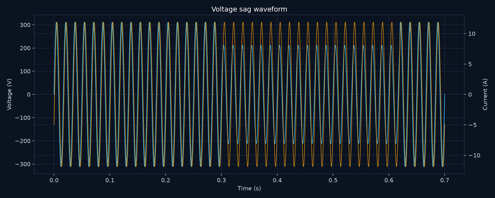
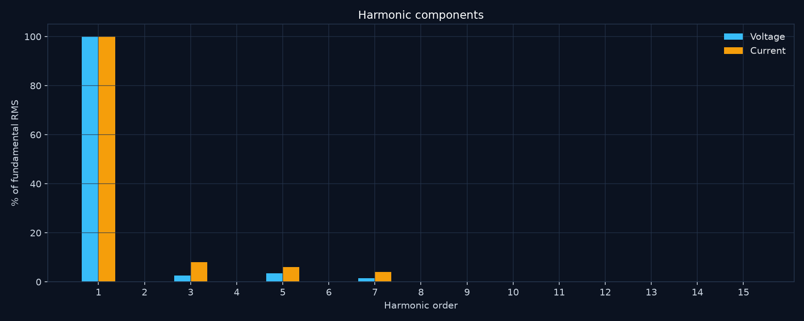

# Power Quality Analyzer

Python-based Power Quality Analyzer for electrical signal processing, power calculation, harmonic analysis, THD estimation, and power-quality event detection.

Built as an Electrical Engineering portfolio project, the application turns synchronized voltage and current samples into technically meaningful metrics, interactive plots, and a timestamped event log.



## About the project

Power quality connects power systems, instrumentation, and digital signal processing. A useful analyzer must do more than plot a waveform: it must respect sampling, distinguish true and displacement power factor, control FFT leakage, and make its event thresholds explicit.

This repository demonstrates that workflow in a compact, testable application. Data can come from included CSV examples, a built-in synthetic generator, or a user upload. The processing layer is independent of Streamlit so a future ESP32 or MQTT adapter can feed the same analysis service.

## Features

- True RMS voltage and current from the complete waveform
- Active power, apparent power, true power factor, and interval energy
- Fundamental reactive power `Q1` and displacement power factor from fitted phasors
- Hann-windowed, coherent-gain-corrected one-sided FFT spectrum
- Fundamental frequency estimation with interpolated spectral peak
- Harmonic RMS magnitudes and voltage/current THD
- Configurable sag, swell, interruption, under/overvoltage, frequency, and THD events
- Professional Streamlit dashboard with four instant demonstration scenarios
- Defensive CSV validation with actionable error messages
- Deterministic synthetic waveform generator and versioned example datasets
- Automated engineering tests with numerical tolerances

## Dashboard

Select **Normal operation**, **Harmonic distortion**, **Voltage sag**, or **Voltage swell** in the sidebar. The dashboard updates the overview, system status, synchronized waveforms, harmonic bars, FFT spectrum, and event table.

| Waveform event | Harmonic analysis |
|---|---|
|  |  |

## Architecture

```text
power-quality-analyzer/
├── app.py
├── src/
│   ├── analysis.py
│   ├── config.py
│   ├── data_loader.py
│   ├── event_detection.py
│   ├── harmonics.py
│   ├── power_calculations.py
│   ├── signal_generator.py
│   └── signal_processing.py
├── data/
│   ├── normal.csv
│   ├── harmonics.csv
│   ├── voltage_sag.csv
│   └── voltage_swell.csv
├── tests/
├── docs/
├── images/
└── scripts/
```

The canonical boundary is a Pandas table with timestamp, voltage, and current. `analysis.py` coordinates independent numerical modules and returns an `AnalysisResult` for the dashboard or a future database adapter. See [architecture details](docs/architecture.md).

## How it works

- **RMS** is `sqrt(mean(x²))`, so distortion and DC content are included.
- **Active power** is the mean of sample-by-sample instantaneous power `v × i`.
- **Apparent power** is `Vrms × Irms`; **true PF** is `P/S` even for distorted signals.
- **Reactive power** is reported as fundamental `Q1` from voltage/current phasors. The project does not misuse `sqrt(S²-P²)` as reactive power under distortion.
- **Frequency** comes from the dominant Hann-windowed FFT peak in a configurable search range.
- **Harmonics** are fitted at integer multiples of the estimated fundamental to reduce off-bin leakage bias.
- **THD** is the RMS root-sum-square of harmonics 2…H divided by fundamental RMS.
- **Events** use nominal one-cycle RMS windows; global frequency and THD checks use the full capture.

The complete definitions and sign conventions are in [docs/equations.md](docs/equations.md).

## Installation

Python 3.11 or newer is recommended.

```bash
git clone https://github.com/CarlosLautert/power-quality-analyzer.git
cd power-quality-analyzer
python -m venv .venv
```

Activate the environment on Linux or macOS:

```bash
source .venv/bin/activate
pip install -r requirements.txt
streamlit run app.py
```

On Windows PowerShell:

```powershell
.venv\Scripts\Activate.ps1
pip install -r requirements.txt
streamlit run app.py
```

The application opens at `http://localhost:8501`.

## CSV input

The file must contain at least 64 numeric samples, strictly increasing and approximately uniform timestamps in seconds, and exactly the required columns (additional columns are ignored):

```csv
timestamp,voltage,current
0.000000,0.000000,-4.976181
0.000208,24.412688,-4.005345
0.000417,48.674327,-2.935816
```

The application infers sample rate from the median timestamp interval and rejects missing values, non-finite values, duplicate time points, and excessive sampling jitter.

## Tests

Run the complete suite from the repository root:

```bash
pytest
```

The tests cover known sinusoidal RMS/power values, true power factor under distortion, interval energy, non-bin-centered frequency, FFT amplitude normalization, harmonic magnitudes, THD, CSV validation, synthetic scenarios, sag, swell, and the end-to-end pipeline.

## Demonstration thresholds and standards

`src/config.py` contains editable **demonstration limits**. They are useful for software behavior and portfolio demonstrations but are not claimed as utility limits or compliance criteria.

The terminology and scope are informed by [IEC 61000-4-30](https://webstore.iec.ch/en/publication/71611), which addresses power-quality measurement methods, and [IEEE 1159-2019](https://standards.ieee.org/ieee/1159/6124/), which provides recommended practice for monitoring and describing power-quality phenomena. This project does not implement their full aggregation, uncertainty, instrument-class, or conformance requirements.

## Reproducible assets

Example data and static README figures can be regenerated from the repository root:

```bash
python -m scripts.generate_examples
python -m scripts.generate_assets
```

## Roadmap

- **Version 1 — Core:** RMS, power calculations, waveform visualization
- **Version 2 — Spectrum:** FFT, harmonics, and THD
- **Version 3 — Events:** power-quality event detection and dashboard improvements
- **Version 4 — Acquisition:** ESP32, ADS1115, isolated voltage/current sensors, and calibrated real-time measurements
- **Version 5 — Monitoring:** MQTT, InfluxDB, Grafana, AWS, and historical storage
- **Version 6 — Intelligence:** anomaly detection and interpretable machine-learning experiments

Versions 1–3 are represented in this repository; the later items are intentionally future work.

## Known limitations

- Single-phase, offline analysis only; no live streaming or three-phase unbalance yet.
- Frequency and THD event checks summarize the full capture rather than a sliding aggregation sequence.
- Abrupt synthetic envelopes are useful for tests but do not model every physical transient.
- No sensor calibration, anti-alias hardware model, uncertainty budget, or instrument conformance testing.
- Harmonic accuracy remains limited by acquisition duration, sample rate, timing quality, noise, and Nyquist.

## Disclaimer

This is educational engineering software, not a certified power-quality analyzer, protection relay, revenue meter, or compliance instrument. Do not use it for safety decisions, contractual measurements, or standards certification without appropriate hardware, calibration, uncertainty analysis, and independent validation.

## License

Released under the [MIT License](LICENSE).
