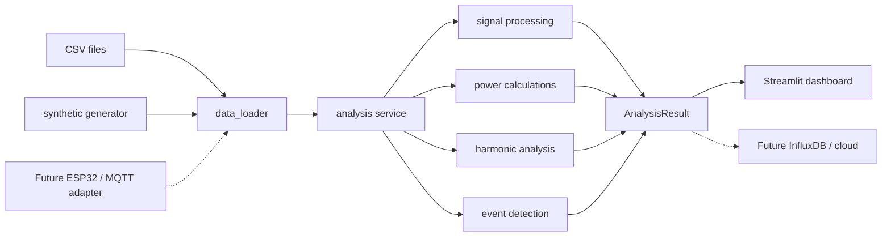

# Architecture

The project separates acquisition concerns from electrical analysis so that a future hardware adapter can reuse the same processing pipeline.

## Responsibilities

- `data_loader.py`: validates the canonical `timestamp, voltage, current` table and infers sample rate.
- `signal_generator.py`: creates deterministic engineering test cases without acquisition hardware.
- `signal_processing.py`: owns sampling checks, frequency estimation, and the display spectrum.
- `power_calculations.py`: owns waveform RMS, power, phasor, power-factor, and energy calculations.
- `harmonics.py`: owns harmonic regression and THD.
- `event_detection.py`: converts configurable thresholds into timestamped events.
- `analysis.py`: orchestrates modules and returns one immutable result object.
- `app.py`: renders results; it contains no electrical formulas.

## Extension path

A hardware or streaming integration should produce the same three-column measurement frame, then call `analyze_measurements`. An ESP32/MQTT adapter therefore belongs at the boundary, not inside the numerical modules. Batch persistence to InfluxDB or a cloud service can consume `AnalysisResult` without changing the algorithms.

Real-time operation will need additional decisions that are intentionally outside version 1: buffer overlap, clock synchronization, resampling, dropped-packet policy, anti-alias filtering, sensor calibration, and incremental event state.

